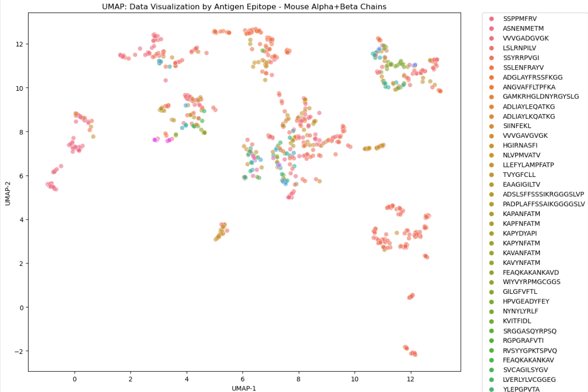
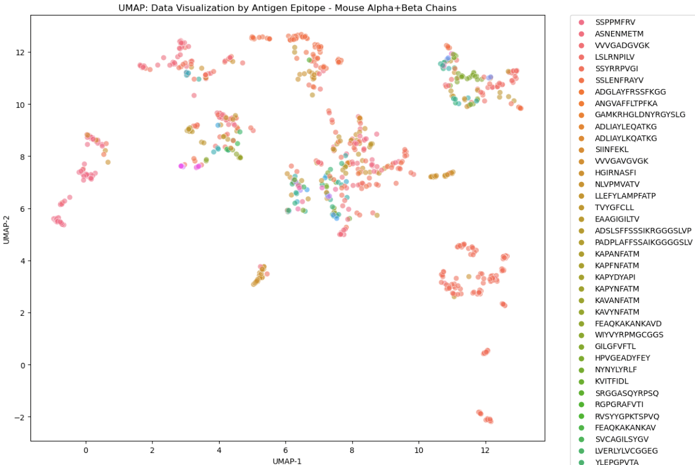
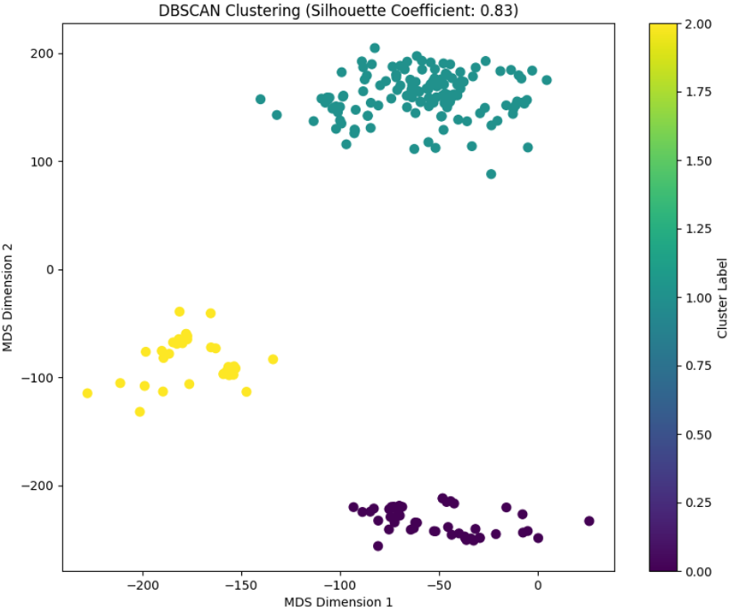
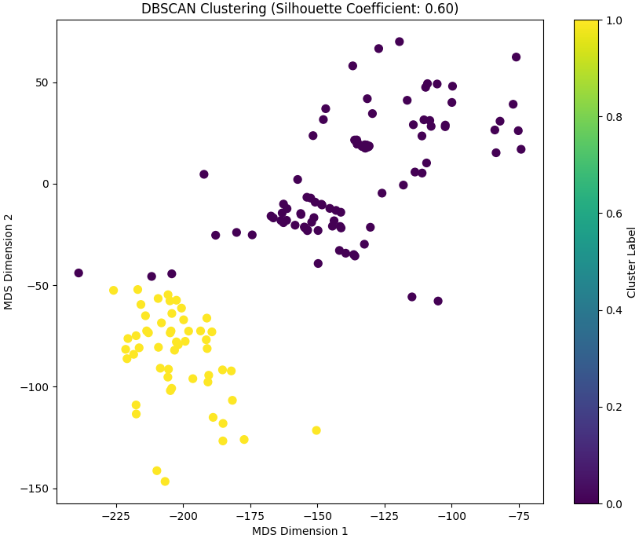
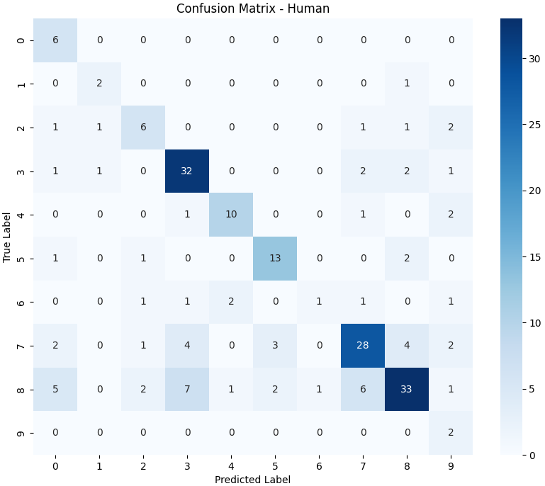

# Prediction of T-cell Receptor (TCR) Specificity Using Machine Learning



## Table of Contents
- [Overview](#overview)
- [Key Features](#key-features)
- [Project Structure](#project-structure)
- [Dataset](#dataset)
- [Methodology](#methodology)
- [Results](#results)
- [Installation](#installation)
- [Usage](#usage)
- [References](#references)
- [Contact](#contact)

---

## Overview

This project applies machine learning to predict T-cell receptor (TCR) specificity using open-source data from VDJdb. We analyze human and mouse TCR sequences, compute distance matrices, visualize them using UMAP, and predict antigen specificity via KNN and Random Forest classifiers.

> **Goal:** Predict epitope specificity of TCRs using interpretable and scalable ML methods.

---

## Key Features

- Distance matrix computation via **TCRdist3**
- Cross-species analysis (Human & Mouse)
- UMAP + MDS visualizations
- Clustering via **DBSCAN** with silhouette evaluation
- Classification using **KNN** and **Random Forest**
- Insightful biological interpretations with visualizations

---

## Project Structure

```
├── main.py
├── group09-report.pdf
├── vdjdb.csv
├── tr_human_alpha_beta.csv
├── tr_mouse_alpha_beta.csv
├── tr_human_alpha_beta_color.csv
├── tr_mouse_alpha_beta_color.csv
├── images/
│   ├── figure_5_1.png
│   ├── figure_5_2.png
│   ├── figure_6_3.png
│   ├── figure_6_4.png
│   ├── figure_7_5.png
│   ├── figure_7_6.png
```

---

## Dataset

- Source: [VDJdb Database](https://vdjdb.cdr3.net/)
- Preprocessed for confidence score, species type, and chain pairing.
- Used α, β, and paired α+β chains for analysis.

---

## Methodology

1. **Preprocessing**: Filter and format VDJdb data
2. **Distance Matrix**: Calculate pairwise distances using TCRdist3
3. **Visualization**: UMAP for 2D reduction of TCR similarity
4. **Clustering**: DBSCAN for unsupervised clustering of specificity
5. **Prediction**: KNN and Random Forest for epitope classification

---

## Results

### UMAP Visualizations

  
*UMAP projection of mouse TCR sequences colored by antigen specificity.*

  
*UMAP projection of human TCR sequences colored by antigen specificity.*

### Clustering Results

  
*DBSCAN clustering of mouse TCRs (Silhouette Score: 0.83).*

  
*DBSCAN clustering of human TCRs (Silhouette Score: 0.60).*

### Prediction Performance

  
*Mouse specificity prediction via KNN. Accuracy: 0.80, F1: 0.79.*

  
*Human specificity prediction via KNN. Accuracy: 0.66, F1: 0.66.*

---

## Installation

### Requirements
- Python ≥ 3.7
- `pip install -r requirements.txt`  
  Or install manually:
```bash
pip install numpy pandas scikit-learn matplotlib seaborn tcrdist3 umap-learn
```

---

## Usage

```bash
python main.py
```

For step-by-step analysis, use Jupyter Notebook if available. Ensure the required CSV files are in the same directory.

---

## References

- VDJdb: Goncharov et al. (2022)
- TCRdist3: https://tcrdist3.readthedocs.io
- UMAP: Becht et al. (2019)
- See full list in [group09-report.pdf](group09-report.pdf)

---

## Contact

Created by **Uchit Bhadauriya**  
University of Bristol | ir23063@bristol.ac.uk  
[LinkedIn Profile](https://www.linkedin.com/in/uchit-bhadauriya-a96478204)

---

> ⭐️ Star this repo if you found it useful! Fork it to build on this work or open an issue for questions.

---

## Usage

```bash
python main.py
```

For step-by-step analysis, use Jupyter Notebook if available. Ensure the required CSV files are in the same directory.

---

## References

- VDJdb: Goncharov et al. (2022)
- TCRdist3: https://tcrdist3.readthedocs.io
- UMAP: Becht et al. (2019)
- See full list in [group09-report.pdf](group09-report.pdf)

---

## Contact

Created by **Uchit Bhadauriya**  
University of Bristol | ir23063@bristol.ac.uk

---

⭐️ Star this repo if you found it useful! Fork it to build on this work or open an issue for questions.
